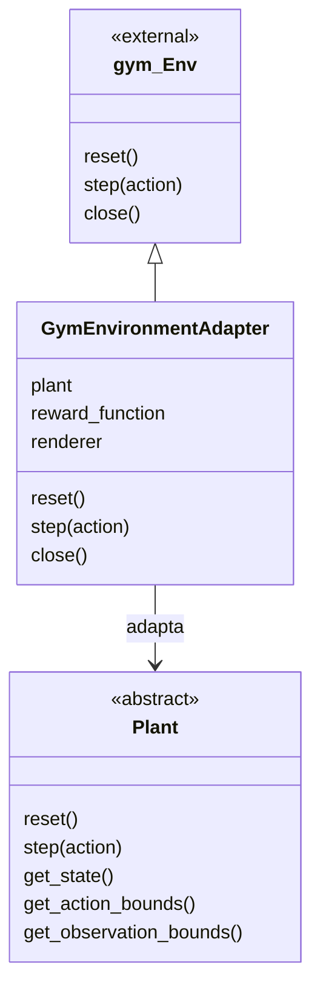
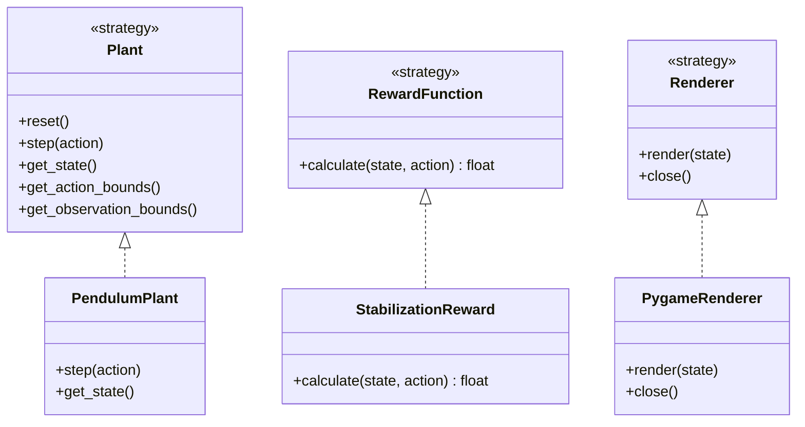

# Entornos de Gymnasium: péndulo y ejemplos

Este repositorio contiene dos proyectos educativos para experimentar con [Gymnasium](https://gymnasium.farama.org/) y simulación de sistemas dinámicos en Python:

- `pendulum/`: simulación de un péndulo simple controlado por torque, con renderizado en Pygame.
- `pygame_gymnasium/`: entorno discreto mínimo en el que un agente mueve una posición hasta el objetivo `10`.

El proyecto del péndulo aplica los patrones de diseño **Adapter** y **Strategy** para separar la simulación, la recompensa, el renderizado y la integración con Gymnasium.

## Requisitos

- Python `3.12` o superior.
- Poetry.
- Pygame, NumPy y Gymnasium, instalados mediante las dependencias de cada `pyproject.toml`.

## Instalación y ejecución

Cada carpeta es un proyecto Poetry independiente.

### Simulación del péndulo

```powershell
cd pendulum
poetry install
poetry run python main.py
```

La ejecución abre una ventana de Pygame y muestra el estado del péndulo mientras se aplican acciones aleatorias dentro del rango permitido.

### Entorno simple

```powershell
cd pygame_gymnasium
poetry install
poetry run python main.py
```

Este ejemplo utiliza dos acciones discretas: `0` para mover la posición a la izquierda y `1` para moverla a la derecha.

## Modelo matemático del péndulo

El sistema modela un péndulo simple con masa $m$, longitud $l$, gravedad $g$, coeficiente de amortiguamiento $b$, torque aplicado $\tau$, ángulo $\theta$ y velocidad angular $\dot{\theta}$.

El estado del sistema es:

$$
\mathbf{x} =
\begin{bmatrix}
	\theta \\
\dot{\theta}
\end{bmatrix}
$$

La ecuación de movimiento implementada en `PendulumPlant` es:

$$
\ddot{\theta} =
\frac{\tau - b\dot{\theta} - mgl\sin(\theta)}{ml^2}
$$

Los términos representan, respectivamente, el torque de control, el amortiguamiento y el torque gravitacional.

### Parámetros por defecto

| Parámetro | Símbolo | Valor |
| --- | --- | ---: |
| Masa | $m$ | `1.0` |
| Longitud | $l$ | `1.0` |
| Gravedad | $g$ | `9.81` |
| Amortiguamiento | $b$ | `0.05` |
| Paso temporal | $\Delta t$ | `0.02` |

### Integración numérica

La aceleración angular se integra con un método de Euler semi-implícito:

$$
\dot{\theta}_{t+1} = \dot{\theta}_t + \ddot{\theta}_t\Delta t
$$

$$
	\theta_{t+1} = \theta_t + \dot{\theta}_{t+1}\Delta t
$$

Después de cada paso, el ángulo se normaliza al intervalo $[-\pi, \pi]$:

$$
	\theta \leftarrow (\theta + \pi) \bmod (2\pi) - \pi
$$

El estado inicial es $\theta = \pi/2$ y $\dot{\theta} = 0$.

## Espacios de Gymnasium

El adaptador expone los siguientes espacios:

- **Observación:** `Box([-pi, -inf], [pi, inf])`.
- **Acción:** `Box([-2.0], [2.0])`, donde la acción es el torque $\tau$.

Cada llamada a `step(action)`:

1. aplica el torque a la planta;
2. actualiza el estado;
3. obtiene la observación;
4. calcula la recompensa;
5. renderiza el estado, si existe un renderizador;
6. devuelve `(observation, reward, terminated, truncated, info)`.

En la implementación actual el episodio no termina automáticamente: `terminated` y `truncated` permanecen en `False`.

## Recompensa de estabilización

`StabilizationReward` penaliza el error angular, la velocidad angular y el uso de torque:

$$
R(\theta, \dot{\theta}, \tau) =
-\left(
	w_\theta\theta^2
	+ w_{\dot{\theta}}\dot{\theta}^2
	+ w_\tau\tau^2
\right)
$$

Los pesos por defecto son:

$$
w_\theta = 1.0, \qquad
w_{\dot{\theta}} = 0.1, \qquad
w_\tau = 0.01
$$

La recompensa es mayor cuando el péndulo se acerca a $\theta = 0$, tiene poca velocidad angular y requiere poco torque.

## Arquitectura

### Adapter

`GymEnvironmentAdapter` implementa la interfaz `gym.Env` y adapta las abstracciones propias de la simulación al contrato esperado por Gymnasium.



El adaptador no conoce los detalles de la ecuación del péndulo. Solo utiliza la interfaz `Plant`, por lo que una planta distinta puede conectarse sin modificar el entorno Gymnasium.

### Strategy

Las interfaces abstractas del dominio definen familias de comportamientos intercambiables:



La composición usada en `main.py` es:

```python
plant = PendulumPlant()
reward_function = StabilizationReward()
renderer = PygameRenderer()
env = GymEnvironmentAdapter(plant, reward_function, renderer)
```

Esto permite cambiar de forma independiente:

- la planta, por otra implementación de `Plant`;
- la función de recompensa, por otra implementación de `RewardFunction`;
- el renderizador, por una implementación distinta de `Renderer` o por `None`.

## Estructura principal

```text
pendulum/
├── main.py
├── pyproject.toml
├── domain/
│   ├── plant.py                  # Interfaz de la planta
│   ├── reward.py                 # Interfaz de la recompensa
│   ├── renderer.py               # Interfaz del renderizador
│   └── state.py                  # Reservado para el modelo de estado
├── environments/
│   └── environment_adapter.py   # Adaptador hacia Gymnasium
├── plants/
│   └── simulation/
│       └── pendulum_plant.py     # Dinámica del péndulo
├── rewards/
│   └── stabilization_reward.py   # Estrategia de recompensa
└── renderers/
	└── pygame_renderer.py        # Estrategia de visualización

pygame_gymnasium/
├── main.py
├── pyproject.toml
└── simple_env.py                 # Entorno discreto de ejemplo
```

## Estado actual

El repositorio sirve como base para experimentar con aprendizaje por refuerzo. El agente de ejemplo selecciona acciones aleatorias; todavía no se incluye un algoritmo de entrenamiento ni una política aprendida.
